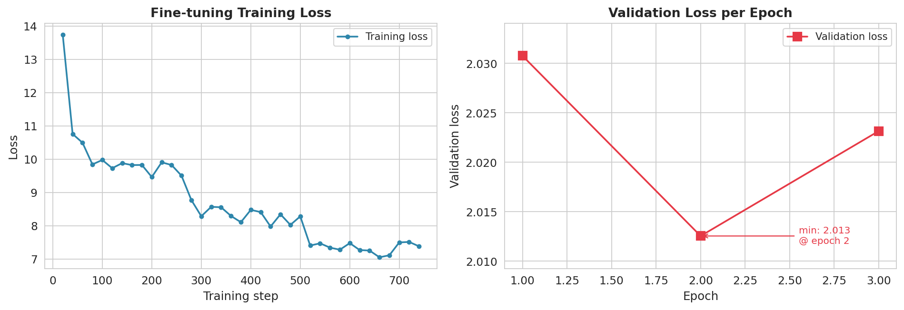
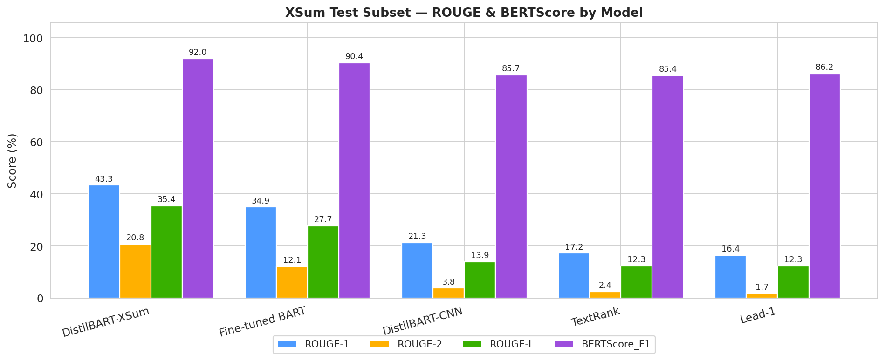
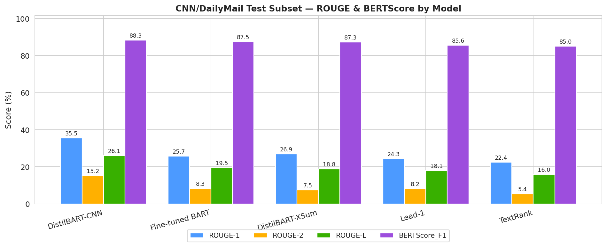
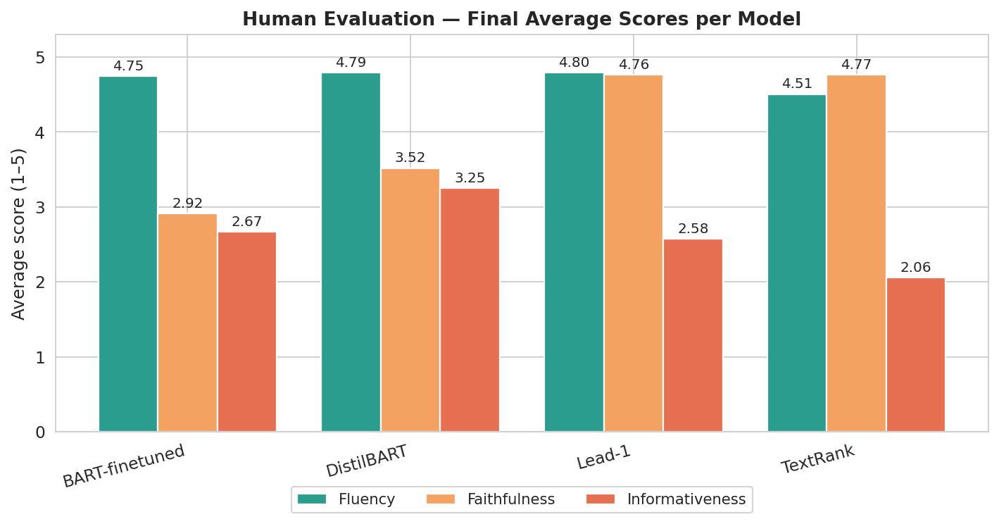

# Neural News Summarisation with BART and DistilBART

This project builds an end-to-end neural news summarisation pipeline using XSum and CNN/DailyMail. It compares extractive baselines, pre-trained DistilBART checkpoints, and a BART-base model fine-tuned on XSum, then evaluates the outputs using automatic metrics, qualitative analysis, and human evaluation.

The main experiment pipeline is provided in:

```text
News_Summarisation_with_BART_and_DistilBART.ipynb
```

## Project Overview

The project covers the full workflow of a neural summarisation experiment:

* loading and preprocessing XSum and CNN/DailyMail datasets;
* building extractive baselines with Lead-1 and TextRank;
* running pre-trained DistilBART models for XSum-style and CNN/DailyMail-style summarisation;
* fine-tuning `facebook/bart-base` on XSum;
* evaluating summaries with ROUGE and BERTScore;
* reviewing common qualitative errors such as hallucination, omission, and fluency issues;
* collecting human evaluation scores for fluency, faithfulness, and informativeness;
* reporting inter-annotator agreement with Krippendorff's alpha;
* providing a CLI demo for summary generation.

## Repository Structure

```text
neural-news-summarisation-bart/
├── README.md
├── requirements.txt
├── .gitignore
├── News_Summarisation_with_BART_and_DistilBART.ipynb
├── src/
│   └── summarise_cli.py
├── examples/
│   └── sample_news_article.txt
├── docs/
│   └── demo_notes.txt
└── results/
    ├── quantitative/
    │   ├── all_quantitative_evaluation_results.csv
    │   ├── cnndm_quantitative_evaluation.csv
    │   └── xsum_quantitative_evaluation.csv
    ├── training/
    │   └── training_log_history.csv
    ├── human_evaluation/
    │   ├── human_score_summary.csv
    │   ├── krippendorff_alpha_results.csv
    │   ├── model_level_human_scores.csv
    │   └── rater_scores/
    │       ├── human_evaluation_rater_01_scores.csv
    │       ├── human_evaluation_rater_02_scores.csv
    │       └── human_evaluation_rater_03_scores.csv
    └── figures/
        ├── 01_training_curves.png
        ├── 02_xsum_metrics_bar.png
        ├── 03_cnndm_metrics_bar.png
        ├── 04_cross_dataset_comparison.png
        ├── 05_human_eval_average.png
        ├── 06_human_eval_heatmap.png
        ├── 07_human_eval_boxplot.png
        ├── 08_per_annotator_scores.png
        └── 09_krippendorff_alpha.png
```

## Datasets

This project uses two English news summarisation datasets:

* **XSum**: used for extreme single-sentence summarisation.
* **CNN/DailyMail**: used for multi-sentence news summarisation evaluation.

The datasets are loaded through Hugging Face in the notebook. This repository does not include the raw or processed dataset text files.

Dataset references:

* XSum: https://huggingface.co/datasets/EdinburghNLP/xsum
* CNN/DailyMail: https://huggingface.co/datasets/abisee/cnn_dailymail

## Models and Methods

The project compares five summarisation methods:

| Method          | Type                     | Description                                                     |
| --------------- | ------------------------ | --------------------------------------------------------------- |
| Lead-1          | Extractive baseline      | Uses the first sentence of the article as the summary.          |
| TextRank        | Extractive baseline      | Uses graph-based sentence ranking to select a summary sentence. |
| DistilBART-XSum | Pre-trained neural model | Uses `sshleifer/distilbart-xsum-12-6`.                          |
| DistilBART-CNN  | Pre-trained neural model | Uses `sshleifer/distilbart-cnn-12-6`.                           |
| Fine-tuned BART | Fine-tuned neural model  | Fine-tunes `facebook/bart-base` on XSum.                        |

Model references:

* DistilBART-XSum: https://huggingface.co/sshleifer/distilbart-xsum-12-6
* DistilBART-CNN: https://huggingface.co/sshleifer/distilbart-cnn-12-6
* BART-base: https://huggingface.co/facebook/bart-base

## Selected Results

### Fine-tuning Progress

The training curve below shows the optimisation process for the BART-base model fine-tuned on XSum.



### Automatic Evaluation on XSum

The figure below compares ROUGE and BERTScore results across baseline, pre-trained, and fine-tuned summarisation methods on XSum.



### Automatic Evaluation on CNN/DailyMail

The figure below shows how the same summarisation methods perform on CNN/DailyMail, which has a different summary style from XSum.



### Human Evaluation

The human evaluation compares summary quality across fluency, faithfulness, and informativeness.



## Evaluation

The project uses both automatic and human evaluation.

### Automatic Evaluation

The automatic evaluation compares model outputs using:

* ROUGE-1
* ROUGE-2
* ROUGE-L
* BERTScore F1

The quantitative result files are stored in:

```text
results/quantitative/
```

### Human Evaluation

Human evaluation is based on three criteria:

| Dimension       | Meaning                                                          |
| --------------- | ---------------------------------------------------------------- |
| Fluency         | Whether the summary is grammatical and readable.                 |
| Faithfulness    | Whether the summary is factually supported by the article.       |
| Informativeness | Whether the summary captures important content from the article. |

The public rater-score files include only sample IDs, model names, and human ratings. Article text, reference summaries, and generated summaries are excluded to avoid redistributing dataset-derived text.

Cleaned public rater scores are stored in:

```text
results/human_evaluation/rater_scores/
```

Aggregated human evaluation results are stored in:

```text
results/human_evaluation/
```

## Result Files

The repository includes selected result artefacts that are safe and useful for project inspection.

### Quantitative Results

```text
results/quantitative/all_quantitative_evaluation_results.csv
results/quantitative/cnndm_quantitative_evaluation.csv
results/quantitative/xsum_quantitative_evaluation.csv
```

These files summarise automatic evaluation results across datasets and model variants.

### Training Log

```text
results/training/training_log_history.csv
```

This file records the training history for the fine-tuned BART model.

### Human Evaluation Results

```text
results/human_evaluation/human_score_summary.csv
results/human_evaluation/krippendorff_alpha_results.csv
results/human_evaluation/model_level_human_scores.csv
```

These files provide aggregated human evaluation results and inter-annotator agreement scores.

### Figures

```text
results/figures/
```

The figure directory contains visualisations for model training, automatic evaluation, cross-dataset comparison, human evaluation, and inter-annotator agreement.

## Setup

Install the required packages with:

```bash
pip install -r requirements.txt
```

The notebook was developed for a Colab-style workflow with GPU support. Local execution is possible, but model inference and fine-tuning may be slow without a GPU.

## Running the Notebook

Open the notebook:

```text
News_Summarisation_with_BART_and_DistilBART.ipynb
```

Then run the cells in order.

The notebook downloads datasets and model checkpoints through Hugging Face when needed. Large intermediate files, full prediction files, processed dataset splits, and fine-tuned model weights are not included in this repository.

## Important Colab Re-run Note

If the notebook is re-run from the beginning in Google Colab, some folders need to exist before the human-evaluation result loading cells are executed.

In the original Colab workflow, the project folder is:

```text
/content/drive/MyDrive/news_summarisation_bart/
```

Before running the human-evaluation aggregation section, create this folder path in Google Drive:

```text
news_summarisation_bart/human_evaluation_outputs/completed/
```

Then upload the completed rater files into that folder with the exact filenames:

```text
news_summarisation_bart/human_evaluation_outputs/completed/human_evaluation_completed_rater_01.csv
news_summarisation_bart/human_evaluation_outputs/completed/human_evaluation_completed_rater_02.csv
news_summarisation_bart/human_evaluation_outputs/completed/human_evaluation_completed_rater_03.csv
```

On Windows, the equivalent local-style path may look like:

```text
news_summarisation_bart\human_evaluation_outputs\completed\human_evaluation_completed_rater_01.csv
```

The public repository does not include the original completed rater CSV files because those files contain dataset-derived article text, reference summaries, and generated summaries. Instead, this repository includes cleaned rater-score files and aggregated human-evaluation results.

## Running the CLI Demo

The CLI script is provided in:

```text
src/summarise_cli.py
```

Run the demo with the provided sample article:

```bash
python src/summarise_cli.py --file_path examples/sample_news_article.txt
```

You can also pass raw text directly:

```bash
python src/summarise_cli.py --text "The city council announced a new public transport plan on Tuesday..."
```

The CLI generates summaries using:

* Lead-1;
* TextRank;
* DistilBART-XSum;
* DistilBART-CNN;
* fine-tuned BART if the local fine-tuned model directory is available.

If the fine-tuned model directory is not available, the CLI still runs the other methods and reports that the fine-tuned model is missing.

## Gradio Demo Notes

The original project also included a Gradio demo design. The demo notes are stored in:

```text
docs/demo_notes.txt
```

The demo is designed to accept news article text and optionally a reference summary. It produces summaries from the available models and can display ROUGE scores when a reference summary is provided.

## Files Not Included

The following files are intentionally excluded from the public repository:

```text
processed_data/
baseline_outputs/
pretrained_model_outputs/
qualitative_analysis_outputs/
finetuned_bart_xsum/model.safetensors
finetuned_bart_xsum/model/
finetuned_bart_xsum/prediction_files/
human_evaluation_outputs/completed/
news_summarisation_bart.zip
```

These files are excluded because they may contain dataset-derived article text, reference summaries, generated summaries, large model weights, or temporary packaged outputs.

## Reproducibility

The repository supports reproducibility at three levels:

1. **Notebook-level reproduction**
   The main notebook documents the full experimental pipeline.

2. **Result-level inspection**
   Quantitative metrics, human evaluation summaries, training logs, and figures are included under `results/`.

3. **CLI-level demonstration**
   The CLI script and sample article allow quick testing of the summarisation methods without using the full notebook workflow.

To fully reproduce the original human-evaluation stage, rerun the notebook, regenerate or upload the completed rater CSV files locally, and place them under:

```text
news_summarisation_bart/human_evaluation_outputs/completed/
```

## Limitations

* The fine-tuned model weights are not included because they are large and better suited to model hosting platforms rather than GitHub.
* Full prediction files are not included because they contain dataset-derived text and generated summaries.
* Human evaluation is based on a limited manual assessment setup and should be interpreted as a qualitative complement to automatic metrics.
* ROUGE and BERTScore measure lexical or semantic similarity, but they do not fully capture factual correctness or usefulness.

## References

* XSum Dataset: https://huggingface.co/datasets/EdinburghNLP/xsum
* CNN/DailyMail Dataset: https://huggingface.co/datasets/abisee/cnn_dailymail
* DistilBART-XSum: https://huggingface.co/sshleifer/distilbart-xsum-12-6
* DistilBART-CNN: https://huggingface.co/sshleifer/distilbart-cnn-12-6
* BART-base: https://huggingface.co/facebook/bart-base
* BART Paper: https://arxiv.org/abs/1910.13461
* BERTScore Paper: https://arxiv.org/abs/1904.09675

## License and Usage Notes

No separate license file is currently included in this repository. The code and outputs are provided for portfolio and educational review.

Third-party datasets and pre-trained models remain subject to their original licenses, terms, and dataset/model cards. This repository does not redistribute the original datasets or model weights.
