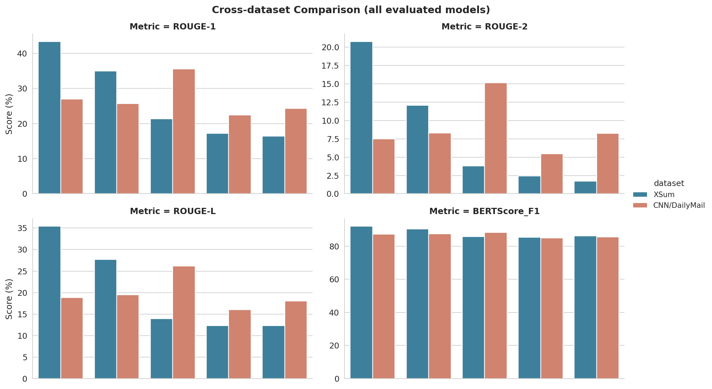
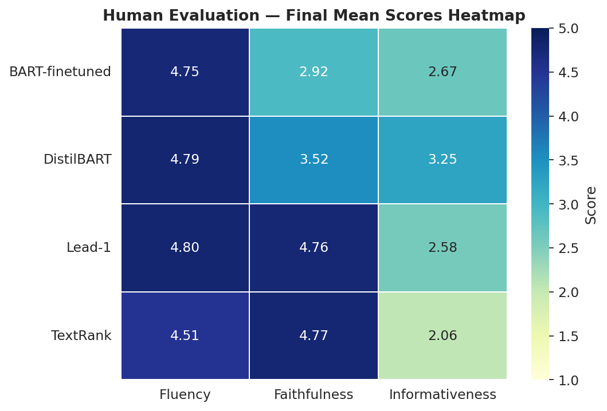
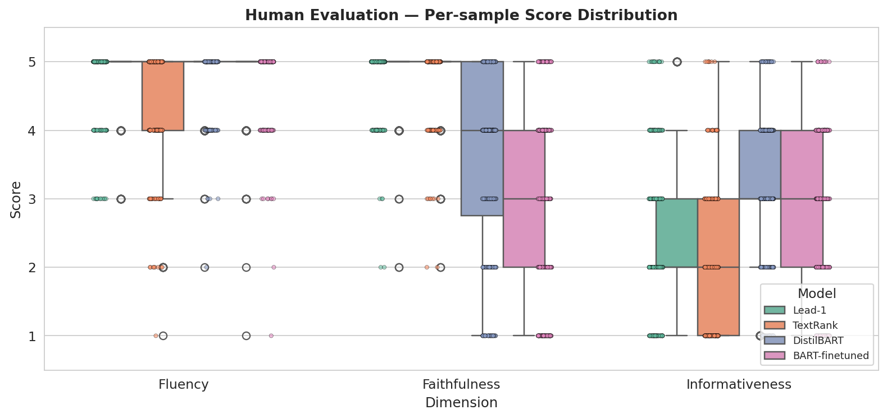
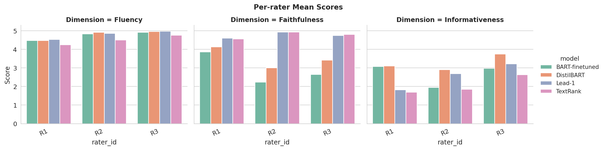
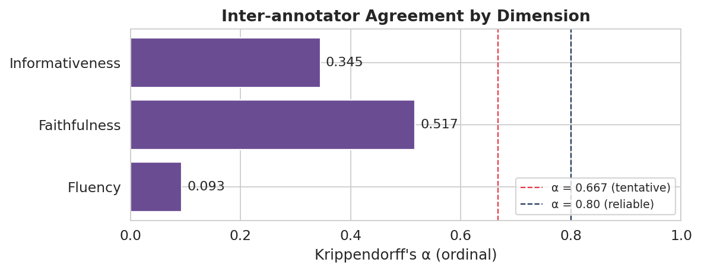

# Neural News Summarisation with BART and DistilBART

This repository contains an end-to-end news summarisation workflow comparing extractive baselines, pre-trained DistilBART checkpoints, and a BART-base model fine-tuned on XSum.

The project evaluates summarisation behaviour across XSum and CNN/DailyMail using automatic metrics, qualitative error analysis, human evaluation, a command-line interface, and a Gradio demo.

## Project Overview

Automatic news summarisation aims to convert long-form news articles into concise summaries while preserving the most important information. This project compares traditional extractive approaches with abstractive neural summarisation models.

The evaluated methods are:

| Method          | Type                     | Description                                                            |
| --------------- | ------------------------ | ---------------------------------------------------------------------- |
| Lead-1          | Extractive baseline      | Uses the first sentence of the article as the summary                  |
| TextRank        | Extractive baseline      | Ranks sentences through graph-based lexical similarity                 |
| DistilBART-XSum | Abstractive neural model | Pre-trained summarisation checkpoint for XSum-style summaries          |
| DistilBART-CNN  | Abstractive neural model | Pre-trained summarisation checkpoint for CNN/DailyMail-style summaries |
| Fine-tuned BART | Abstractive neural model | `facebook/bart-base` fine-tuned on the XSum training subset            |

Although the workflow is organised around four summarisation approaches, the quantitative evaluation reports five concrete model outputs because DistilBART is tested with two dataset-specific checkpoints.

## Key Features

* End-to-end notebook-based summarisation pipeline.
* Comparison between extractive baselines and abstractive neural models.
* Experiments on XSum and CNN/DailyMail.
* Fine-tuning of `facebook/bart-base` on a reduced XSum training subset.
* Automatic evaluation with ROUGE-1, ROUGE-2, ROUGE-L, and BERTScore.
* Qualitative error analysis for hallucination, omission, and fluency issues.
* Human evaluation across fluency, faithfulness, and informativeness.
* Inter-annotator agreement analysis using Krippendorff's alpha.
* CLI script for testing summaries from direct text input or a text file.
* Gradio demo notes for interactive side-by-side model comparison.

## Repository Structure

```text
neural-news-summarisation-bart/
├── README.md
├── requirements.txt
├── .gitignore
├── News_Summarisation_with_BART_and_DistilBART.ipynb
├── src/
│   └── summarise_cli.py
├── examples/
│   └── sample_news_article.txt
├── docs/
│   └── demo_notes.txt
└── results/
    ├── quantitative/
    │   ├── all_quantitative_evaluation_results.csv
    │   ├── cnndm_quantitative_evaluation.csv
    │   └── xsum_quantitative_evaluation.csv
    ├── training/
    │   └── training_log_history.csv
    ├── human_evaluation/
    │   ├── human_score_summary.csv
    │   ├── krippendorff_alpha_results.csv
    │   ├── model_level_human_scores.csv
    │   └── rater_scores/
    │       ├── human_evaluation_rater_01_scores.csv
    │       ├── human_evaluation_rater_02_scores.csv
    │       └── human_evaluation_rater_03_scores.csv
    └── figures/
        ├── 01_training_curves.png
        ├── 02_xsum_metrics_bar.png
        ├── 03_cnndm_metrics_bar.png
        ├── 04_cross_dataset_comparison.png
        ├── 05_human_eval_average.png
        ├── 06_human_eval_heatmap.png
        ├── 07_human_eval_boxplot.png
        ├── 08_per_annotator_scores.png
        └── 09_krippendorff_alpha.png
```

## Datasets

The project uses two public news summarisation datasets:

| Dataset       | Summary Style                                                         | Use in This Project        |
| ------------- | --------------------------------------------------------------------- | -------------------------- |
| XSum          | Short, highly abstractive single-sentence summaries                   | Fine-tuning and evaluation |
| CNN/DailyMail | Longer news-style summaries, often closer to extractive summarisation | Cross-dataset evaluation   |

The datasets are loaded through the Hugging Face `datasets` library. Raw and processed dataset files are not included in this repository.

Dataset pages:

* XSum: https://huggingface.co/datasets/EdinburghNLP/xsum
* CNN/DailyMail: https://huggingface.co/datasets/abisee/cnn_dailymail

## Experimental Subsets

Reduced subsets are used to keep the workflow suitable for notebook-based experimentation.

| Dataset       |      Split | Samples | Average Article Words | Average Summary Words |
| ------------- | ---------: | ------: | --------------------: | --------------------: |
| XSum          |      Train |   2,000 |                375.38 |                 21.15 |
| XSum          | Validation |     200 |                351.10 |                 20.43 |
| XSum          |       Test |     200 |                400.33 |                 21.25 |
| CNN/DailyMail |      Train |   2,000 |                601.81 |                 43.15 |
| CNN/DailyMail | Validation |     200 |                562.05 |                 33.32 |
| CNN/DailyMail |       Test |     200 |                555.06 |                 34.74 |

During preprocessing, each sample is converted into an article-summary pair. The maximum input length is 512 tokens, and the maximum target length is 64 tokens in the main preprocessing setup.

## Models

The workflow uses the following Hugging Face checkpoints:

| Model                            | Role                                          |
| -------------------------------- | --------------------------------------------- |
| `sshleifer/distilbart-xsum-12-6` | Pre-trained XSum-style summarisation          |
| `sshleifer/distilbart-cnn-12-6`  | Pre-trained CNN/DailyMail-style summarisation |
| `facebook/bart-base`             | Base model for XSum fine-tuning               |

Model pages:

* DistilBART-XSum: https://huggingface.co/sshleifer/distilbart-xsum-12-6
* DistilBART-CNN: https://huggingface.co/sshleifer/distilbart-cnn-12-6
* BART-base: https://huggingface.co/facebook/bart-base

Fine-tuned model weights are not included in this repository. They can be regenerated by rerunning the notebook.

## Fine-Tuning Setup

The fine-tuned model is based on `facebook/bart-base` and trained on the reduced XSum training subset.

| Setting               | Value                          |
| --------------------- | ------------------------------ |
| Base checkpoint       | `facebook/bart-base`           |
| Training data         | XSum train subset              |
| Training examples     | 2,000                          |
| Trainer               | Hugging Face `Seq2SeqTrainer`  |
| Learning rate         | `3e-5`                         |
| Training batch size   | 2                              |
| Evaluation batch size | 2                              |
| Weight decay          | 0.01                           |
| Epochs                | 3                              |
| Warmup ratio          | 0.1                            |
| Scheduler             | Cosine learning-rate scheduler |
| Seed                  | 42                             |
| FP16                  | Enabled when CUDA is available |

## Environment Setup

Install the project dependencies with:

```bash
pip install -r requirements.txt
```

A GPU runtime is recommended for neural model inference and BART fine-tuning.

The main notebook was developed and tested in Google Colab. The CLI script can be run locally after installing the dependencies. Full local execution of the notebook may require adapting Colab or Google Drive paths and regenerating intermediate outputs.

## Running the Notebook

Open the main notebook:

```text
News_Summarisation_with_BART_and_DistilBART.ipynb
```

The notebook includes:

1. Environment setup.
2. Dataset loading.
3. Dataset preprocessing.
4. Lead-1 baseline generation.
5. TextRank baseline generation.
6. DistilBART inference.
7. BART-base fine-tuning.
8. Quantitative evaluation.
9. Qualitative error analysis.
10. Human-evaluation preparation and aggregation.
11. Result visualisation.
12. CLI and Gradio demo preparation.

## Important Colab Re-run Note

When rerunning the notebook in Google Colab, the human-evaluation aggregation section expects completed rater files to exist locally.

Before running that section, create the following folder structure:

```text
news_summarisation_bart/
└── human_evaluation_outputs/
    └── completed/
        ├── human_evaluation_completed_rater_01.csv
        ├── human_evaluation_completed_rater_02.csv
        └── human_evaluation_completed_rater_03.csv
```

For example, the first completed rater file should be placed at:

```text
news_summarisation_bart/human_evaluation_outputs/completed/human_evaluation_completed_rater_01.csv
```

On Windows, the same path may appear as:

```text
news_summarisation_bart\human_evaluation_outputs\completed\human_evaluation_completed_rater_01.csv
```

The public repository includes cleaned rater-score files under:

```text
results/human_evaluation/rater_scores/
```

These cleaned files retain only sample IDs, model names, and human scores. They exclude article text, reference summaries, and generated summaries to avoid redistributing dataset-derived content.

## Command-Line Demo

The repository includes a CLI script:

```text
src/summarise_cli.py
```

Run the CLI with direct text input:

```bash
python src/summarise_cli.py --text "The city council announced a new public transport plan..."
```

Or run it with the provided example article:

```bash
python src/summarise_cli.py --file_path examples/sample_news_article.txt
```

The CLI outputs summaries from:

* Lead-1.
* TextRank.
* DistilBART-XSum.
* DistilBART-CNN.
* Fine-tuned BART, if the local fine-tuned model directory is available.

If the fine-tuned model files are not available, the CLI still runs the other methods and prints a message for the missing fine-tuned model.

## Gradio Demo

The notebook includes a Gradio demo section for interactive testing.

The demo accepts:

* A news article as input.
* An optional reference summary.

It displays summaries from multiple models side by side. When a reference summary is provided, ROUGE-1, ROUGE-2, and ROUGE-L are also displayed.

Additional demo notes are available at:

```text
docs/demo_notes.txt
```

## Evaluation Metrics

The project uses automatic evaluation, qualitative error analysis, and human evaluation.

### Automatic Evaluation

| Metric       | Purpose                                                  |
| ------------ | -------------------------------------------------------- |
| ROUGE-1      | Measures unigram overlap                                 |
| ROUGE-2      | Measures bigram overlap                                  |
| ROUGE-L      | Measures longest common subsequence overlap              |
| BERTScore F1 | Measures semantic similarity using contextual embeddings |

### Qualitative Error Analysis

The qualitative analysis focuses on three error types:

| Error Type    | Description                                                          |
| ------------- | -------------------------------------------------------------------- |
| Hallucination | Generated information is unsupported by the source article           |
| Omission      | Important information is missing from the generated summary          |
| Fluency issue | The summary has unnatural wording, repetition, or coherence problems |

Heuristic screening is used to identify candidate error samples for further inspection.

### Human Evaluation

Human evaluation is conducted on a focused subset:

| Item                  | Value |
| --------------------- | ----: |
| Source articles       |   100 |
| Summaries per article |     4 |
| Annotators            |     3 |
| Records per annotator |   400 |
| Total rating records  | 1,200 |
| Score scale           |   1–5 |

The three evaluation dimensions are:

| Dimension       | Meaning                                                             |
| --------------- | ------------------------------------------------------------------- |
| Fluency         | Whether the summary is natural, grammatical, and easy to read       |
| Faithfulness    | Whether the summary is factually consistent with the source article |
| Informativeness | Whether the summary covers the important content                    |

Inter-annotator agreement is measured using Krippendorff's alpha.

## Results

### Fine-Tuning Curves

The training loss decreases across fine-tuning steps, while validation loss reaches its lowest value around the second epoch.


### XSum Quantitative Results

On the XSum test subset, DistilBART-XSum achieves the strongest ROUGE and BERTScore results. The fine-tuned BART model improves over the extractive baselines but remains below the task-specialised DistilBART-XSum checkpoint.


### CNN/DailyMail Quantitative Results

On the CNN/DailyMail test subset, DistilBART-CNN achieves the best overall performance. This reflects the advantage of using a checkpoint aligned with the target dataset style.


### Cross-Dataset Comparison

The cross-dataset comparison shows that summarisation performance depends strongly on dataset style. XSum favours concise abstractive summaries, while CNN/DailyMail favours longer news-style summaries.



## Human Evaluation Results

### Average Human Scores

The human evaluation shows that most systems produce fluent summaries. However, faithfulness and informativeness vary more strongly across models.

Extractive methods such as Lead-1 and TextRank tend to receive strong faithfulness scores because they directly reuse source sentences. Neural abstractive models can produce fluent summaries but may introduce unsupported or incomplete information.


### Human Score Heatmap

The heatmap summarises the model-level human evaluation scores across fluency, faithfulness, and informativeness.



### Per-Sample Distribution

The per-sample distribution shows the variation in human scores across models and dimensions.



### Per-Annotator Scores

The per-annotator results show broadly consistent scoring trends across raters.



### Inter-Annotator Agreement

Krippendorff's alpha is reported for each human-evaluation dimension. Agreement is strongest for faithfulness, while fluency has lower agreement because most summaries receive relatively high fluency scores.



## Included Results

The repository includes aggregate and cleaned result files:

```text
results/quantitative/
results/training/
results/human_evaluation/
results/figures/
```

These files support inspection of the reported results without exposing full dataset-derived text.

## Files Not Included

The following files are intentionally excluded:

* Raw XSum and CNN/DailyMail datasets.
* Processed dataset splits.
* Full baseline prediction files.
* Full pre-trained model prediction files.
* Full fine-tuned model prediction files.
* Fine-tuned model weights.
* Original completed rater sheets containing article text, reference summaries, or generated summaries.
* Large archive files.
* Local Colab or Google Drive cache files.

These files are excluded because they are large, reproducible from the notebook, or contain dataset-derived text.

## Reproducibility Notes

The notebook can be rerun to regenerate local intermediate files. Full reproduction of the original workflow requires:

1. Downloading datasets through Hugging Face.
2. Running preprocessing.
3. Generating Lead-1 and TextRank summaries.
4. Running DistilBART inference.
5. Fine-tuning BART-base on XSum.
6. Regenerating prediction files.
7. Preparing human-evaluation templates.
8. Providing completed rater sheets.
9. Running human-evaluation aggregation.
10. Recreating result figures.

The repository provides cleaned rater scores and aggregate result files for transparent inspection of final results.

## Current Execution Status

| Component                     | Status                                                      |
| ----------------------------- | ----------------------------------------------------------- |
| Main notebook                 | Colab-first workflow                                        |
| Local CLI                     | Supported after dependency installation                     |
| Full local notebook run       | Requires path adaptation and regenerated intermediate files |
| Raw datasets                  | Not included; loaded through Hugging Face                   |
| Fine-tuned weights            | Not included; can be regenerated                            |
| Full prediction files         | Not included                                                |
| Aggregate results and figures | Included                                                    |

## Limitations

* The fine-tuned model was trained on a reduced subset rather than the full XSum dataset.
* The fine-tuning setup is designed for notebook-based experimentation rather than large-scale optimisation.
* Human evaluation is limited to a focused subset of 100 articles.
* ROUGE and BERTScore do not fully capture factual consistency or usefulness.
* Fine-tuned model weights are not included and need to be regenerated locally.
* Cross-dataset transfer remains challenging because XSum and CNN/DailyMail use different summary styles.
* Full local notebook execution requires adapting Colab-specific paths.

## References

* Wafaa S. El-Kassas, Cherif R. Salama, Ahmed A. Rafea, and Hoda K. Mohamed. Automatic Text Summarization: A Comprehensive Survey. Expert Systems with Applications, 165:113679, 2021.
* Shashank Bhargav, Abhinav Choudhury, Shruti Kaushik, Ravindra Shukla, and Varun Dutt. A Comparison Study of Abstractive and Extractive Methods for Text Summarization. Proceedings of PCCDS 2021, Springer, 2022.
* Brian Keith, Michael Horning, and Tanushree Mitra. Evaluating the Inverted Pyramid Structure through Automatic 5W1H Extraction and Summarization. Computational Journalism, 2020.
* Rada Mihalcea and Paul Tarau. TextRank: Bringing Order into Text. Proceedings of EMNLP, 2004.
* Ashish Vaswani, Noam Shazeer, Niki Parmar, Jakob Uszkoreit, Llion Jones, Aidan N. Gomez, Lukasz Kaiser, and Illia Polosukhin. Attention Is All You Need. Advances in Neural Information Processing Systems, 2017.
* Mike Lewis, Yinhan Liu, Naman Goyal, Marjan Ghazvininejad, Abdelrahman Mohamed, Omer Levy, Veselin Stoyanov, and Luke Zettlemoyer. BART: Denoising Sequence-to-Sequence Pre-training for Natural Language Generation, Translation, and Comprehension. Proceedings of ACL, 2020.
* Chin-Yew Lin. ROUGE: A Package for Automatic Evaluation of Summaries. Text Summarization Branches Out, 2004.
* Tianyi Zhang, Varsha Kishore, Felix Wu, Kilian Q. Weinberger, and Yoav Artzi. BERTScore: Evaluating Text Generation with BERT. ICLR, 2020.
* Mousumi Akter, Naman Bansal, and Shubhra Kanti Karmaker. Revisiting Automatic Evaluation of Extractive Summarization Task: Can We Do Better than ROUGE? Findings of ACL, 2022.
* XSum dataset: https://huggingface.co/datasets/EdinburghNLP/xsum
* CNN/DailyMail dataset: https://huggingface.co/datasets/abisee/cnn_dailymail
* DistilBART-XSum model: https://huggingface.co/sshleifer/distilbart-xsum-12-6
* DistilBART-CNN model: https://huggingface.co/sshleifer/distilbart-cnn-12-6
* BART-base model: https://huggingface.co/facebook/bart-base

## Licence and Data Usage

This repository contains project code, cleaned result summaries, visualisations, and documentation.

No open-source licence is currently granted for the original code, documentation, or generated analysis files in this repository. Reuse, redistribution, or derivative use requires permission.

The underlying datasets and pre-trained models are provided by their original authors and hosting platforms. Users should follow the licences and terms of the original datasets and models.

Dataset-derived full text, full prediction files, raw completed rater sheets, and fine-tuned model weights are not redistributed in this repository.
